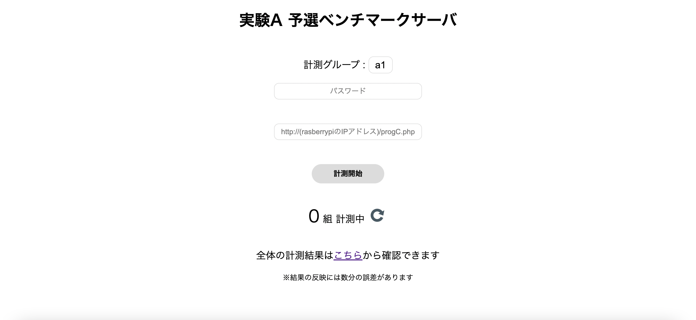

# ベンチマークサーバの説明

## 概要
みなさんが作成したWEBシステムの性能について，ベンチマークサーバを用いて評価します．
WEBシステムからベンチマークサーバに計測リクエストを送信すると，ベンチマークサーバは，みなさんが作成したWebシステムに対して，大量の同時アクセスを行い，1秒あたりのリクエスト処理数といった性能を計測します．
ベンチマークサーバとRaspbeery Piの構成は以下のようになっています．
```{image} ../../../images/part3/part3_2/configuration.png
:alt: ベンチマークサーバの構成図
:width: 400px
:align: center
```

## 予選・本選ベンチマークサーバ
### ベンチマークサーバの使用方法
ベンチマークサーバにアクセスします．（学内からでないとアクセスできません）
- [予選benchmarkserver](https://google.com)
- [本選benchmarkserver](https://google.com)（本選期間のみアクセス可能）



グループ名，事前に配布されたパスワード，みなさんが作成したwebシステムのURLを入力します．

URLは以下のようになると思います．

**フォーマット：**
```
http://<Raspberry PiのIPアドレス>/~<username>/<プログラム名>
```
**入力例：**
```
http://192.168.100.49/~pi/progA.php
```
また，Raspberry PiのIPアドレスはターミナルで以下のコマンドを実行することで確認できます．
```
$ ip a
```
<br>（画像）<br>
上記の場合，`192.168.100.49`がRaspberry PiのIPアドレスとなります．

フォームに情報を入力した後，計測開始ボタンをクリックします．
<br>（画像）<br>

計測開始ボタンをクリックするとキューに追加されます．
待ちがない場合は，そのままwebシステムの性能の計測を行いますが，先に性能を計測している
がある場合は，それらのグループの計測が終了するまで待機します．
<br>（待ちあり・なし画像）<br>

webシステムの計測が正常に終了すると，計測結果が表示されます．
<br>（画像）<br>
予選ベンチマークサーバの場合は，計測結果を記録するか選択可能ですが，本選ベンチマークサーバの場合は，自動的に記録されます．
<br>（予選，本選画像）<br>

## ランキング
[リンク](https://google.com)やベンチマークサーバのトップページに表示されているリンクをクリックすると，全グループの計測結果を見ることができます．
<br>（画像）<br>
他のグループに負けないような高性能なwebシステムの設計を目指しましょう．

## 在宅用ベンチマークサーバ
### 在宅用ベンチマークサーバの概要
在宅用ベンチマークサーバは，在宅で授業を受けており，予選・本選ベンチマークサーバにアクセスすることができない人向けのベンチマークサーバです．
在宅用ベンチマークサーバは，webシステムの性能評価方法の仕様は予選サーバと同等のものですが，計測結果をランキングに反映する機能などはありません．

### 在宅用ベンチマークサーバの使用方法
ベンチマークサーバをダウンロードします．
- `\\fs.inf.in.shizuoka.ac.jp\\share\\class\\情報科学実験I\\第三部サンプルデータ\\benchmarkserver.zip`（静大のネットワーク内からはWindowsファイル共有にて．外部からはVPNを利用してアクセス可能）
ダウンロードしたzipファイルを解凍し，解凍したフォルダ内のmain.exeをダブルクリックし，ベンチマークサーバを起動します．
初回起動時は以下のような警告がでてくると思いますので，hogeを選択してください．
<br>（画像）<br>

すると，コマンドプロンプトが立ち上がり，以下のメッセージが表示されます．
<br>（画像）<br>

次に，webブラウザを開いて，以下のURLを入力し，ベンチマークサーバにアクセスします．
```
http://localhost:3000
```
これ以降の操作は予選サーバと同様です．

### 在宅用ベンチマークサーバのオプションを変更して起動する
在宅用ベンチマークサーバは，オプションを変更して起動することが可能です．
#### コマンドオプション
```{list-table} コマンドオプション
:header-rows: 1
:name: bench_options
* - オプション
  - 意味
  - デフォルト値
* - -n 数値
  - テストで発行するリクエストの回数を数値で指定
  - 0
* - -c 数値
  - テストで同時に発行するリクエストの数を数値で指定
  - 0
* - -t 数値
  - 1リクエストのタイムアウト時間を秒単位で指定
  - 0
* - -r 数値
  - 1の場合のみ計測に使用するタグ名をランダムな順番で選択
  - 1
* - -s 文字列
  - 計測に使用するタグ数を指定．-1の場合は，ファイルに記載されているすべてタグを使用
  - ./hoge/hoge.txt
```
#### 使い方
上記のパラメータを変更して起動するためには，コマンドプロンプトから在宅用ベンチマークサーバを起動する必要があります．
在宅用ベンチマークサーバが存在するフォルダへ移動した後，以下のように実行します．
```
./main -n 5 
```
[コマンドプロンプトの基本的なコマンド一覧](https://docs.microsoft.com/ja-jp/windows-server/administration/windows-commands/windows-commands)